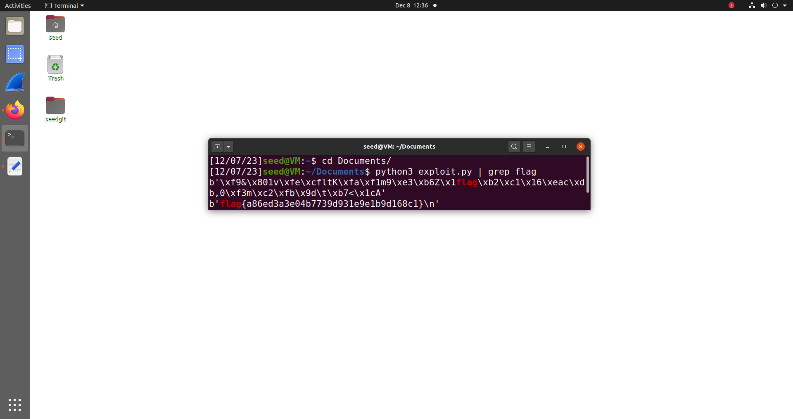

Acedendo ao servidor na porta 6003, são imediatamente emitidos 2 dados em representação hexadecimal: <code>ciphertext</code> e <code>nonce</code>. Deduziu-se que ciphertext será a flag encriptada e através análise do ficheiro *cipherspec.py* facultado, foi possível concluir que nonce é um parâmetro requirido pelo modo de encriptação **AES-CTR** usado. O modo CTR cifra valores sucessivos de um counter, pelo que o "nonce" corresponde ao **Vetor de Inicialização**, ou seja, ao valor com que o counter é inicializado.
Ainda relativamente ao ficheiro em python disponibilizado, analisando-se a função <code>gen</code>, foi possível concluir de que forma a chave da encriptação é gerada e qual é a sua estrutura. A chave tem um comprimento de 16 bytes, dos quais os 13 primeiros são <code>\x00</code> e os 3 últimos (valor definido pela variável <code>offset</code>) são 3 bytes aleatórios gerados pela função **os.urandom**. Sendo assim, todas as keys geradas possúem os primeiros 13 bytes em comum, apenas diferindo nos últimos 3 de offset. Desta forma, para se decifrar uma chave, apenas "basta" ter em conta todas as combinações possíveis de 3 bytes, o que corresponde a uma operação cuja complexidade temporal ainda é computacionalmente aceitável. Assim, a definição do offset para 3 bytes, à qual o criador do ficheiro chama um "Hotfix que tornará a encriptação extremamente rápida", corresponde à otimização infeliz referida no enunciado.
Recolhidas todas estas informações, procedeu-se à elaboração do ataque. Fez-se uma cópia do ficheiro *cipherspec.py* e acrescentou-se o código referente ao ataque de força bruta. Primeiramente criou-se a função <code>keyGen</code>, que tal como a função gen, tem a função de gerar uma key, com a diferença que enquanto gen gera uma key com bytes random, a função keyGen gera uma key com os bytes específicos passados como parâmetros.

```python
def keyGen(byte1,byte2,byte3):
    offset=3	
    key = bytearray(b'\x00'*(16-offset))
    combination = bytes([byte1, byte2, byte3])
    return bytes(key + combination)
```    

Posteriormente elaboraram-se 3 "nested for loops" para testar as várias combinações dos 256 valores possíveis que cada um dos 3 bytes de offset pode assumir. Dentro do ciclo mais interior cria-se uma chave com os valores de byte1 (primeiro ciclo) byte2 (segundo ciclo) e byte3 (último ciclo) e posteriormente chama-se a função dec com a chave gerada, ciphertext e nonce (os últimos dois revertidos ao formato de bytes através da função unhexlify). Para terminar, é dado print ao resultado da desincriptação.

```python
for byte1 in range(256):
    for byte2 in range(256):
        for byte3 in range(256):
            k = keyGen(byte1, byte2, byte3)
            res = dec(k, unhexlify(ciphertext), unhexlify(nonce))
            print(res)
```            
O código completo utilizado pode ser encontrado no ficheiro *exploit.py* na pasta "Code".

De modo a filtrar os resultados e a encontrar a flag, correu-se o código acima utilizando <code>grep flag</code> que agrupa os outputs pela palavra "flag"

```shell
python3 exploit.py | grep flag
```
Deste modo foi possível encontrar a flag:



NOTA: Foi necessário adicionar um terceiro parâmetro à função Cipher utilizada nas funções <code>enc</code> e <code>dec</code> de modo a poder correr o código, caso contrário o seguinte erro ocorria: <code>TypeError: __init__() missing 1 required positional argument: 'backend'</code>. Sendo assim, adicionou-se o backend default <code>backend=default_backend()</code>
