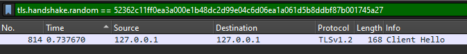
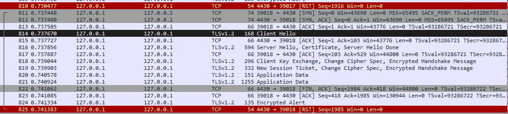
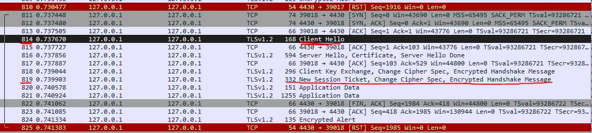
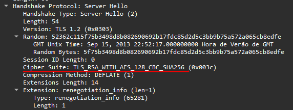
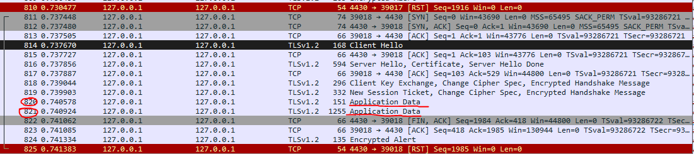
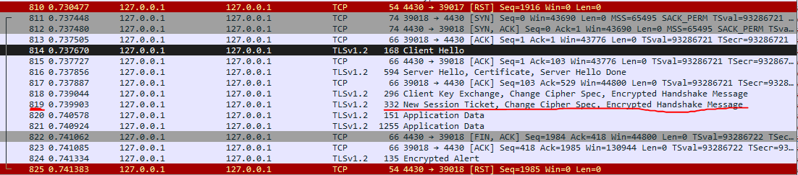
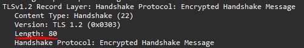

## Identificar o Handshake

Usar o filtro:

tls.handshake.random == 52362c11ff0ea3a000e1b48dc2d99e04c6d06ea1a061d5b8ddbf87b001745a27 

para localizar o frame que contém a mensagem de Client Hello com o número aleatório desejado.

## Determinar os Números de Frame

Anotar o número do frame onde a mensagem de Client Hello com o número aleatório ocorre. Isso será o <frame_start>. Continuar a análise para encontrar o último frame correspondente ao procedimento de handshake do TLS; esse será o <frame_end>.

<frame_start> = 814
<frame_end> = 819

## Encontrar a Ciphersuite Selecionada

Usar a informação dos frames para identificar a ciphersuite escolhida. Procurar pelos campos que indicam a ciphersuite na mensagem de Server Hello.

<selected_cipher_suite> = TLS_RSA_WITH_AES_128_CBC_SHA256

## Calcular a Soma Total do Tamanho dos Dados Cifrados

Encontrar e somar os tamanhos dos packets que contêm a application data

<total_encrypted_appdata_exchanged> = 80 + 1184 = 1264

## Obter o Tamanho da Mensagem Cifrada no Handshake Final

<size_of_encrypted_message> = 80

## Formatar a Flag

flag{814-819-TLS_RSA_WITH_AES_128_CBC_SHA256-1264-80}