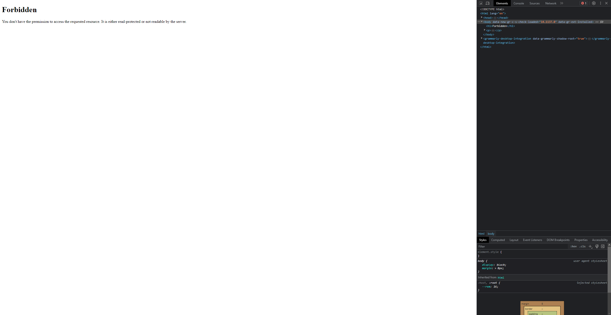

CTF Semana #6 (XSS + CSRF)

Após uma exploração inicial da página, verificamos que o input onde se "justificaria" a razão para obter a flag seria um campo vulnerável a cross-site scripting. De seguida, colocando um input inocente no buffer e submetendo, verificamos a página de espera de receção da flag. Nesta, estava presente um link para poder aceder a página de aceitação de criação de flag por parte de um admin num estado com interação desativada. Apesar disso, foi possivel verificar o código HTML por de trás do botão de cedência da flag. O codigo seria este:


Verificou-se que neste código seria utilizado o request id mencionado na página inicial de justificação de flag. Com isto, procedemos a tentar aceder manualmente ao link de acesso à flag e obtemos a seguinte página:



Com isto, procecemos a tentar provocar o Cross-site scripting exploit colocando na caixa do buffer da justificação da flag, o codigo deste mesmo botão para obter assim a bandeira. Não poderia ser apenas o código do botão em si, pois este não se ativaria sozinho, por isso tivemos de adicionar uma área de scripting no qual o website precionasse o botão. Desta forma, construímos o seguinte code snippet:

```HTML
<form method="POST" action="http://ctf-fsi.fe.up.pt:5005/request/<requestId>/approve" role="form">
    <div class="submit">
        <input type="submit" id="giveflag" value="Give the flag">
    </div>
    <script>
        document.getElementById('giveflag').click();
    </script>
</form>
```

Na construção do link de approve flag, colocamos um placeholder para qualquer request id. Desta forma, preenchemos o buffer com este code snippet, substituindo "\<requestId>" por o id indicado na própria página.

Após submição, verificamos por uma pequena fração de segundo que a página tinha redirecionado para a aba correta na qual se apresentaria a sala de espera da flag mas após essa fração, a página redirecionou uma vez mais, para a página de acesso proibido desta vez.

Concluimos que isto seria devido ao scripting do website não permitir que um usuário precione este botão em qualquer situação. Desta forma, decidimos desativar a habilidade de scripting da página, desativando efetivamente a linguagem JavaScript no browser, para poder bloquear a habilidade de verificação de identidade de usuário e, consequentemente, redirecionamento para a página de proibição.

Com a nova tentativa e o scripting desativo, verificamos o redirecionamento para a página de espera da flag. Esta não apresentava quaisquer alterações em relação à versão original mas relembramo-nos da propriedade do scripting da página de atualizar de 5 em 5 segundos para verificar a divulgação da flag e o facto de que esta estaria desativada. Desta forma, após uma atualização de página manual, o placeholder da flag estava agora populado com a própria flag. Desta forma, demos o CTF como concluído.
