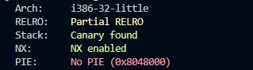
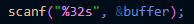
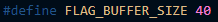
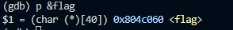
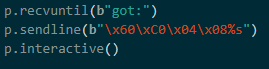
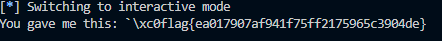
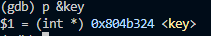
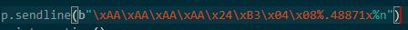
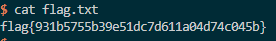

Desafio 1

Primeiramente corremos o comando checksec e verificamos que PIE (Position Independent Executable) não está ativo, logo não há aleatoriedade nos endereços no executável. 

1. Qual é a linha do código onde a vulnerabilidade se encontra?

Encontra-se na linha 25 scanf("%32s", &buffer);.

2. O que é que a vulnerabilidade permite fazer?

A vulnerabilidade pode permitir a um atacante ultrapassar os limites do buffer e sobrescreva áreas adjacentes da memória, uma vez que a função load_flag() carrega mais bytes do que o buffer contém.

3. Qual é a funcionalidade que te permite obter a flag?

A funcionalidade que permite obter a flag é explorar uma format string vulnerability que juntamente com a capacidade de obter o endereço da variável global que armazena a flag nos permite retornar o valor da string.

Usando o gdb descobrimos o endereço da variáveel flag:

Depois utilizando o programa fornecido alteramos a seguinte linha obtendo a flag:

------------------------

Desafio 2

Voltamos a utilizar o checksec e verificamos que o PIE continua desativado.

1. Qual é a linha do código onde a vulnerabilidade se encontra? E o que é que a vulnerabilidade permite fazer?

O código em questão possui uma vulnerabilidade de na linha 13, onde a função scanf lê uma string do usuário sem verificar adequadamente os limites do buffer. Isso pode permitir que um atacante sobrescreva dados na memória, incluindo a variável key. Se um atacante conseguir controlar a variável key e definir seu valor como 0xbeef, a "Backdoor" será ativada.

2. A flag é carregada para memória? Ou existe alguma funcionalidade que podemos utilizar para ter acesso à mesma.

Sim, a chave (key) é carregada na memória, e usando o comando p &key no GDB, é possível aceder o valor armazenado nela.

3. Para desbloqueares essa funcionalidade o que é que tens de fazer?

Para desbloquear a funcionalidade, é necessário utilizar o debugger. (gdb program)

Ao analisarmos o código fornecido, percebemos que não há uma função que abra diretamente o nosso código. No entanto, se a variável key for igual a 0xBEEF, podemos executar o BASH e, assim, abrir o código.

Ao executarmos o programa com o GDB, identificamos onde a variável key está localizada.

Sabemos que 0xBEEF em decimal é igual a 48879.
Escrevemos o endereço e depois temos de escrever os caracteres restantes até 48879 então temos 48879 - 4 - 4 = 48871.

Quando executamos o programa (exploit_example.py), obtemos a flag no arquivo flag.txt.

Resumindo, ao explorar a vulnerabilidade, calculamos o valor necessário para a variável key, preenchemos os espaços correspondentes no endereço e, ao executar o programa, conseguimos obter a flag.

