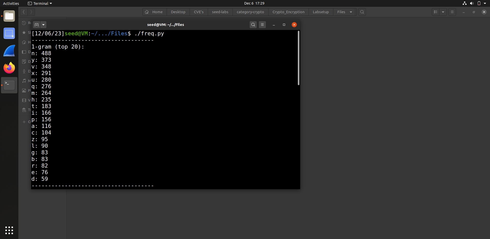
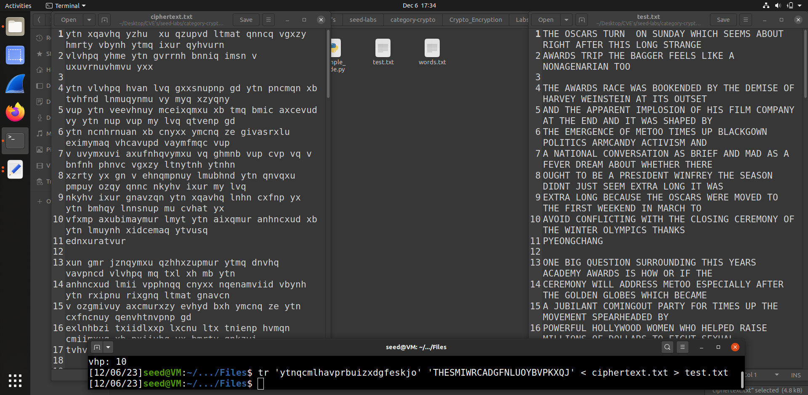
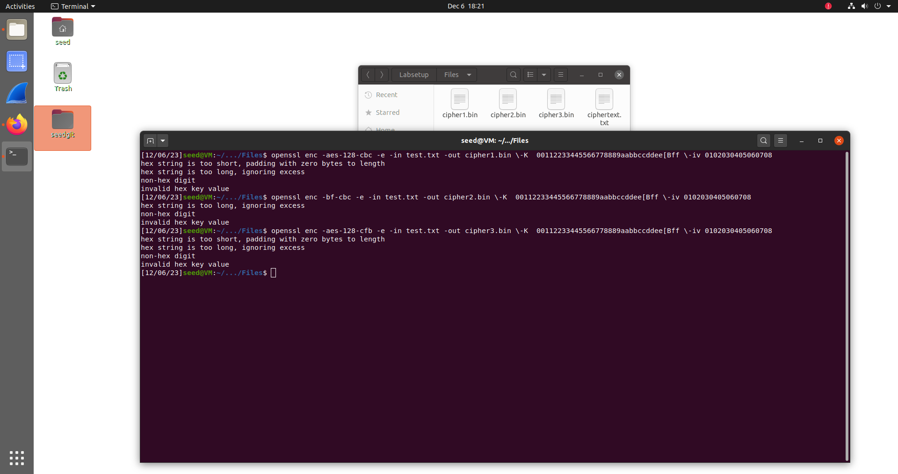
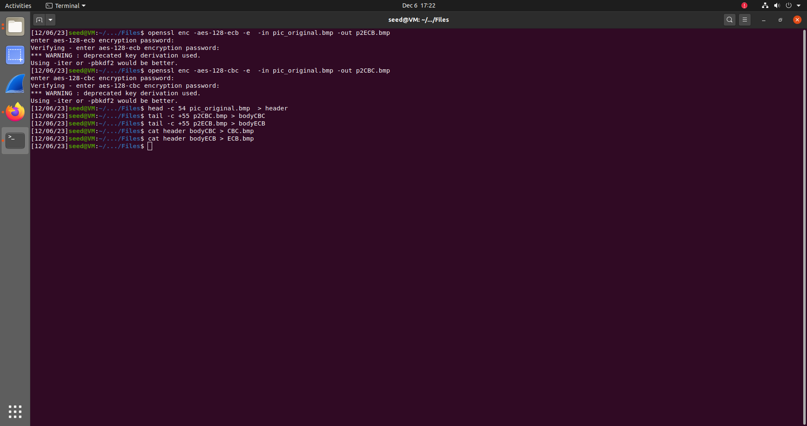
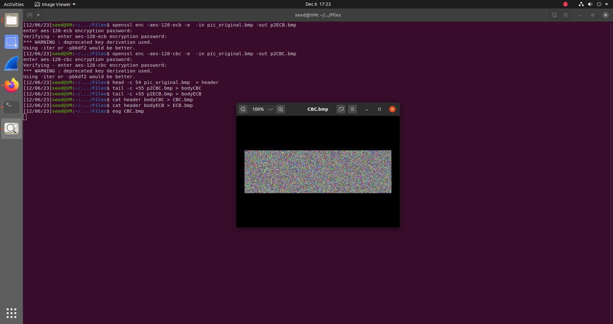
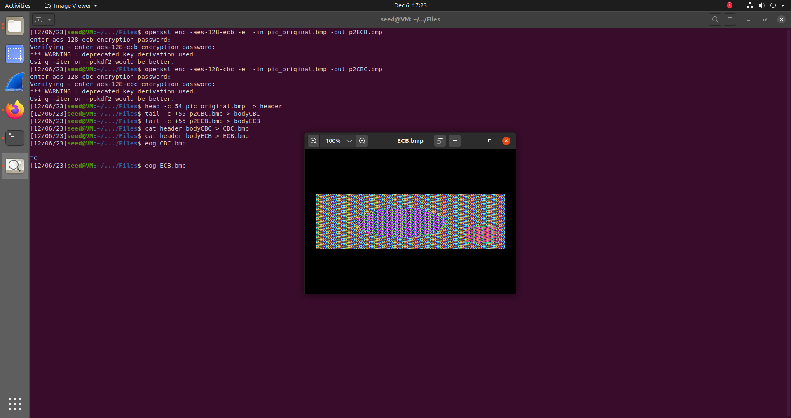
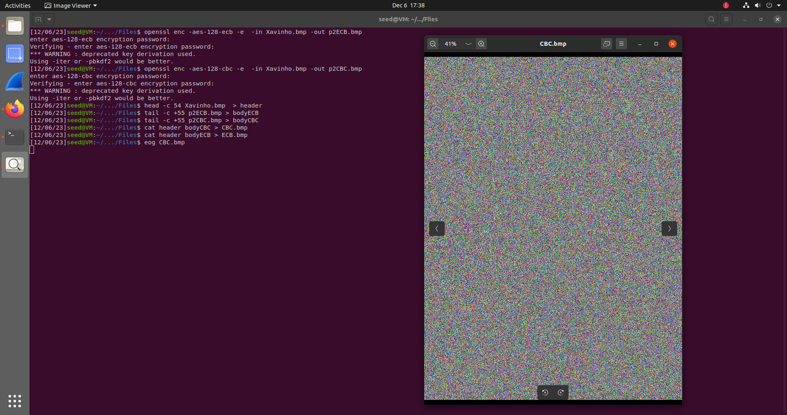
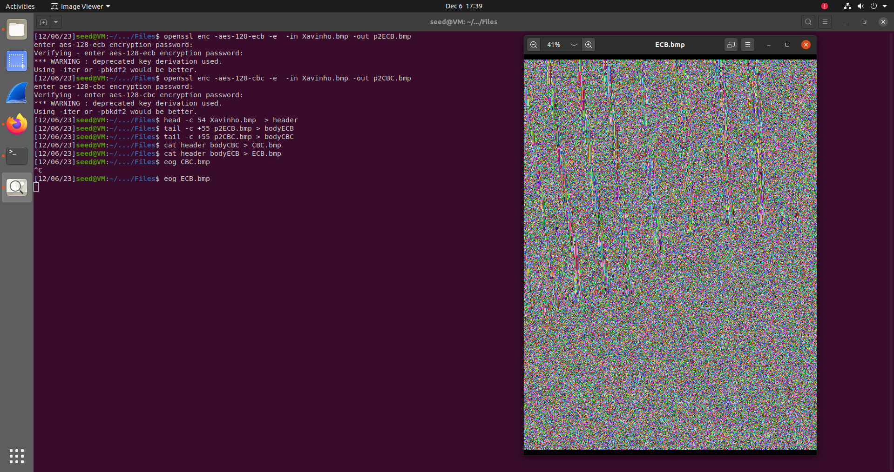

## Task 1

Para esta tarefa foi necessário realizar uma "análise de frequência" num ficheiro encriptado por método de substiuição monoalfabética simplificada. Foi fornecido um script de python para obter os Top 20 de letras repetidas, de tuplos de 2 letras repetidas e de tuplos de 3 letras repetidas. Com esta análise foi possível inferir a cifra de algumas letras. A partir destas, usando palavras semi-cifradas, foi-se gradualmente desencriptando o resto do alfabeto. Finalmente, obteu-se a mensagem decifrada.

## Task 2

Para esta tarefa, encriptou-se o ficheiro test.txt (obtido através da tarefa 1) usando 3 diferentes modos de encriptação. Os binários resultantes foram guardados em 3 diferentes ficheiros .bin
 - aes-128-cbc: 128 bit AES in CBC mode -> para o ficheiro cipher1.bin
 - bf-cbc: Blowfish in CBC mode -> para o ficheiro cipher2.bin
 - aes-128-cbf: 128 bit AES in 128 bit CFB mode -> para o ficheiro cipher3.bin

## Task 3

Para esta tarefa encriptou-se o ficheiro pic_original.bmp utilizando os modos **aes-128-cbc** e **aes-128-ecb** de encriptação.
Começou-se por encriptar o ficheiro pic_original.bmp para um ficheiro a que se chamou *p2ECB.bmp* usando o modo **aes-128-ecb**.
Posteriormente repetiu-se este passo mas desta vez para um ficheiro a que se chamou *p2CBC.bmp* usando o modo **aes-128-cbc**.
Para ambas as encriptações utilizou-se a palavra-passe "secret".
Sabendo que o objetivo é utilizar o header da imagem original e juntá-la ao corpo da imagem encriptada, criou-se uma head universal a ser utilizada por ambas as imagens encriptadas *p2ECB* e *p2CBC* a que se chamou simplesmente "header"
Posteriormente criaram-se ambos os bodies das imagens encriptadas, "bodyCBC" e "bodyECB". 
Finalmente, criou-se a imagem "CBC.bmp" com o header "header" e o body "bodyCBC" e a imagem "ECB.bmp" com o mesmo header e com o body "body ECB"

Utilizando-se o comando <code>eog</code> para dar display a ambas as imagens, foi possível verificar diferenças claras. Enquanto que a imagem *CBC.bmp* corresponde a um conjunto ininteligível de píxeis de várias cores, onde não é possível distinguir qualquer tipo de forma ou padrão, na imagem *ECB.bmp* é possível distinguir-se claramente a oval e o retângulo que compõem a imagem original "pic_original.bmp", embora com bastante ruído e com cores aleatórias.

*NOTA: Os ficheiros .bmp propriamente ditos podem ser ambos encontrados dentro da pasta "Docs" com o nome "CBC.bmp" e "ECB.bmp"*

De modo a consolidar esta tarefa, tal como pedido, efetuou-se o mesmo procedimento acima mas com uma imagem à escolha. Escolheu-se uma imagem do Xavinho, o cão mais bonito do mundo.

Desta vez, observando-se os resultados, o CBC novamente não revela qualquer detalhe da imagem. O ECB, por sua vez, apesar de permitir distinguir algumas formas, não permite a distinção dos diferentes elementos da imagem com a mesma clareza que permitiu para pic_original.bmp.

*NOTA: Os ficheiros .bmp propriamente ditos podem ser ambos encontrados dentro da pasta "Docs" com o nome "XavinhoCBC.bmp" e "XavinhoECB.bmp"*

Concluímos que tal se deve ao facto de as formas apenas serem distinguíveis se houver um claro contraste entre elas, como é o caso das pregas dos cortinados atrás do Xavinho.
