# PKI Lab

### Setup
```
# Labsetup
dcbuild
dcup

# Create new terminal
docker ps -qa
docksh 06

# Create new terminal
sudo nano /etc/hosts

10.9.0.80   www.bank32.com
10.9.0.80   www.fsi74.com
```

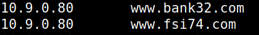

### Task 1

Copiar o ficheiro openssl.cnf para o diretório do trabalho.
```
cp /usr/lib/ssl/openssl.cnf ./openssl.cnf
```
Dentro deste ficheiro descomentar "unique_subject".

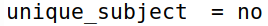

Executamos os comandos a seguir para estabelecer o nosso ambiente:

```
mkdir demoCA
cd demoCA
mkdir certs crl newcerts
touch index.txt
echo "1000" > serial
```

Depois, geramos o *self-signed CA certificate*, utilizando o comando fornecido

```
openssl req -x509 -newkey rsa:4096 -sha256 -days 3650 -keyout ca.key -out ca.crt
```
preenchendo com os dados:

- password: dees
- país: PT
- região: Porto
- cidade: Porto
- organização: FEUP
- secção: LEIC
- nome: FSI
- email:

Utilizamos os seguintes comandos para visualizar o conteúdo decodificado do certificado X509 e da chave RSA:

```
openssl x509 -in ca.crt -text -noout
openssl rsa -in ca.key -text -noout
```

P1: Qual a parte do certificado indica que se trata de um *CA’s certificate*? (CA:TRUE)

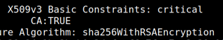

P2: Qual a parte do certificado indica que se trata de um *self-signed certificate*? (Subject Key Identifier = Authority Key Identifier)

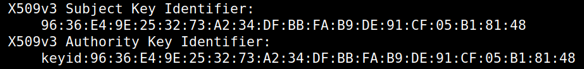

P3: No algoritmo RSA, temos a *public exponent* (e), a *private exponent* (d), a *modulus* (n) e dois *secret numbers* (p e q), de forma que n = pq. Por favor, identifique os valores desses elementos nos teus arquivos de certificado e chave.

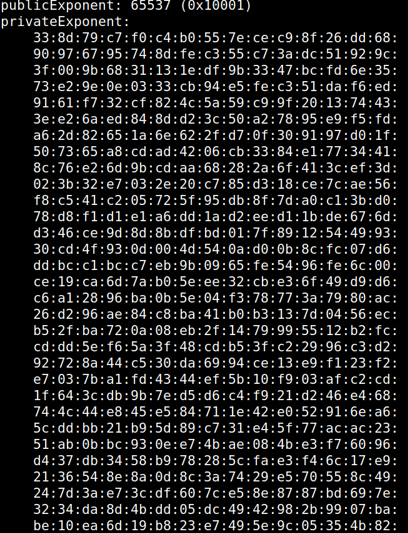

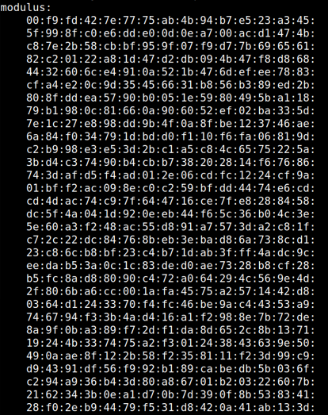

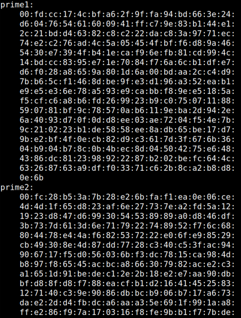

### Task2

O seguinte comando foi usado para gerar a CSR:
```
openssl req -newkey rsa:2048 -sha256 -keyout server.key -out server.csr -subj "/CN=www.fsi74.com/O=fsi74 Inc./C=US" -addext "subjectAltName = DNS:www.fsi74.com, DNS:www.fsi74A.com, DNS:www.fsi74B.com" -passout pass:dees
```

O comando irá gerar um par de chaves pública/privada e, em seguida, criar uma solicitação de assinatura de certificado a partir da chave pública. Podemos utilizar o seguinte comando para visualizar o conteúdo decodificado dos arquivos CSR (Certificate Signing Request) e da chave privada:

```
openssl req -in server.csr -text -noout
```

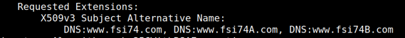

### Task3

O comando a seguir transforma o *certificate signing request* (server.csr) em um *X509
certificate* (server.crt), utilizando o ca.crt e ca.key da CA (Autoridade Certificadora):

```
openssl ca -config openssl.cnf -policy policy_anything \
-md sha256 -days 3650 \
-in server.csr -out server.crt -batch \
-cert ca.crt -keyfile ca.key
```

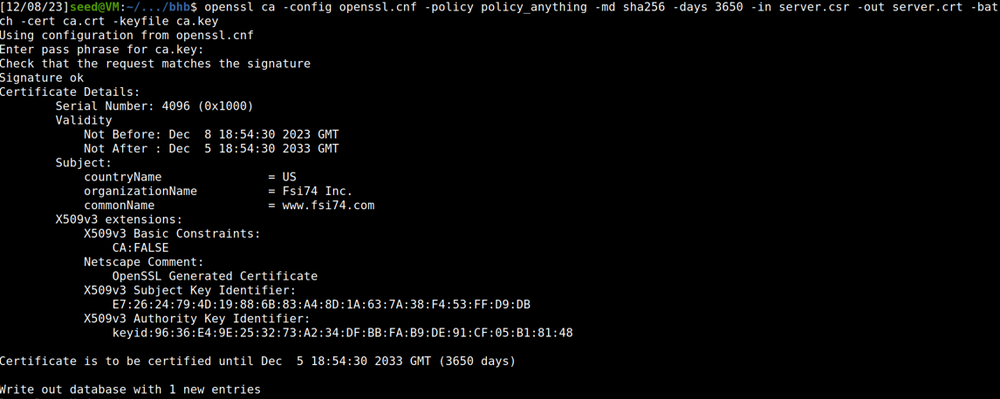

Por razões de segurança, a configuração padrão no openssl.cnf não permite que o comando openssl ca copie o campo de extensão da solicitação para o certificado final.

Para realizar esta tarefa, precisamos habilitar essa funcionalidade. Podemos fazer isso descomentando a linha "copy_extensions = copy" na nossa cópia do arquivo openssl.cnf.

Depois executamos o comando:

```
openssl x509 -in server.crt -text -noout
```

e obtivemos:

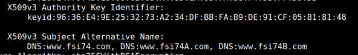

### Task4

Criamos uma pasta "Task4". Dentro colocamos um ficheiro "Dockerfile", o ficheiro "fsi74_apache_ssl.cnf", o "indext.html" e "index_red.html" e uma pasta "certs" com os cretificados "ca.crt", "server.crt" e "server.key".

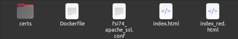

Dockerfile:

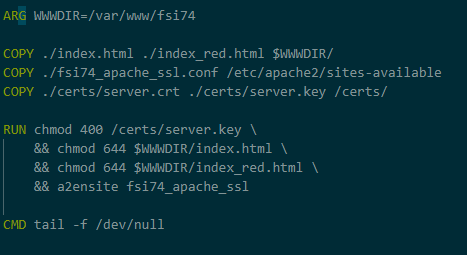

fsi74_apache_ssl.cnf:

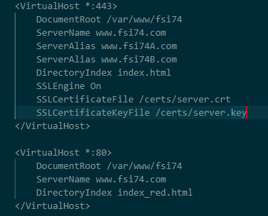

docker-compose.yml:


Na shell do container corremos "service apache atart" com a password "dees" e entramos em "https://www.fsi74.com. Deparamo-nos com este aviso:

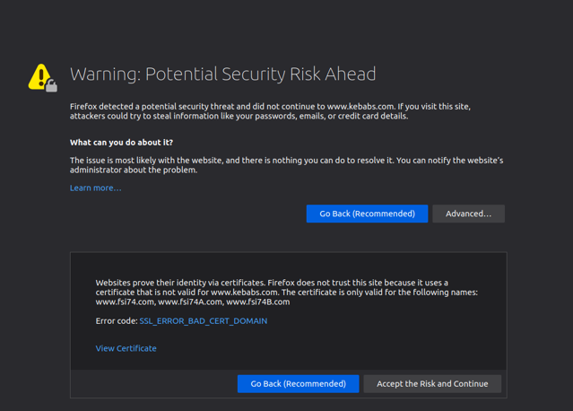

Isso ocorre porque o Firefox possui apenas certificados altamente seguros no seu banco de certificados, o que significa que um certificado *self-signed* é motivo para exibir um aviso.

Para evitar o aviso podemos dizer ao browser para confiar no nosso certificado:

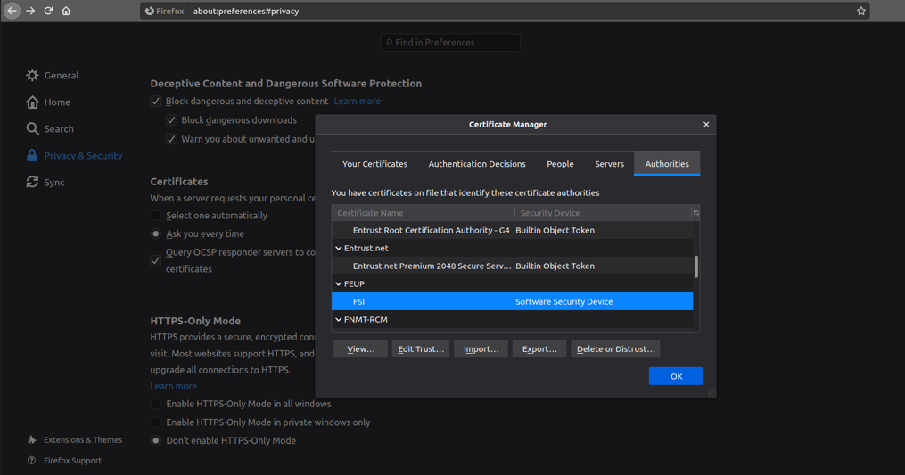

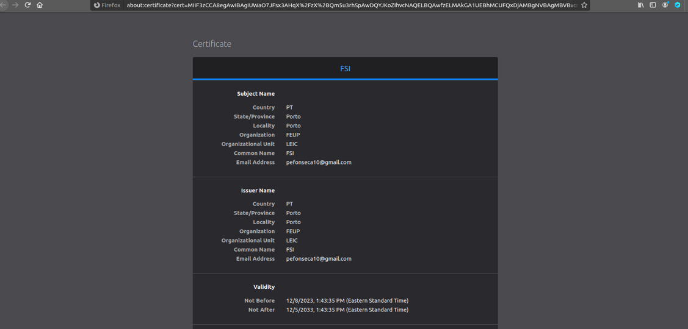

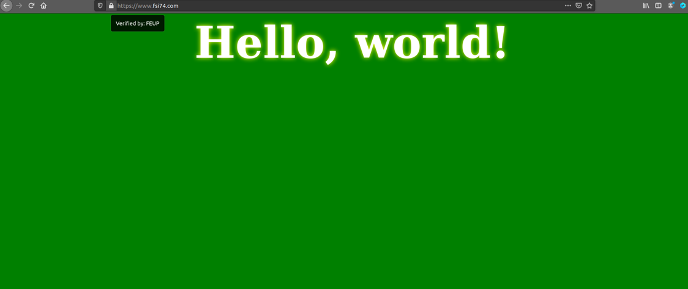

### Task 5

A Tarefa 5 têm como objetivo demonstrar a eficácia da *public-key encryption*, especificamente a *Certification Authority (CA) signature*, na prevenção de *Man-In-The-Middle (MITM) attacks*, desde que as chaves de certificação permaneçam seguras. Isso envolve dois passos principais.

No primeiro passo, é configurado um site malicioso para interceptar comunicações. Usando o servidor Apache configurado na Tarefa 4, é adicionada uma entrada VirtualHost ao arquivo de configuração SSL, com o ServerName configurado para o site alvo (por exemplo, www.kebabs.com). Devido à indisponibilidade de um certificado válido para www.kebabs.com, é utilizado o mesmo certificado usado no servidor do atacante.

No segundo passo, o atacante deve manipular a *routing table* da máquina do host da vítima para redirecionar as solicitações HTTP para o site malicioso estabelecido no primeiro passo. Isto é geralmente alcançado modificando a *DNS routing table*, como exemplificado pela adição da seguinte entrada em /etc/hosts: 10.9.0.80 www.kebabs.com.

Apesar da *DNS route exploitation*, quando Alice tenta visitar www.kebabs.com, o navegador emite um aviso. Isso ocorre porque o certificado usado para assinar www.kebabs.com é emitido para outro domínio (www.fsi74.com). Navegadores modernos conseguem detectar tais divergências de certificado e alertar os usuários.

Se o usuário optar por prosseguir apesar do aviso, o acesso a www.kebabs.com é concedido. No entanto, o aviso prévio serve como uma medida de precaução, notificando o usuário sobre o potencial risco associado à discrepância de certificado.

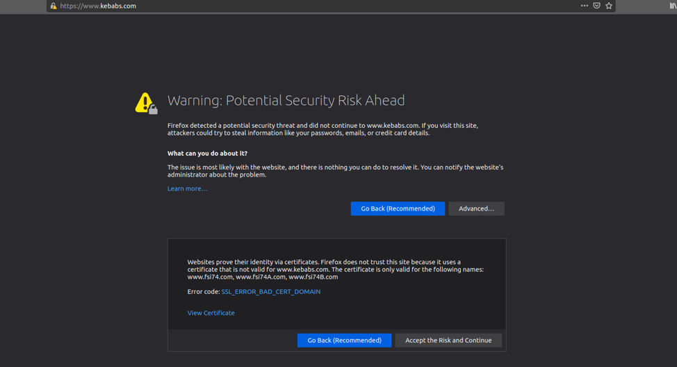

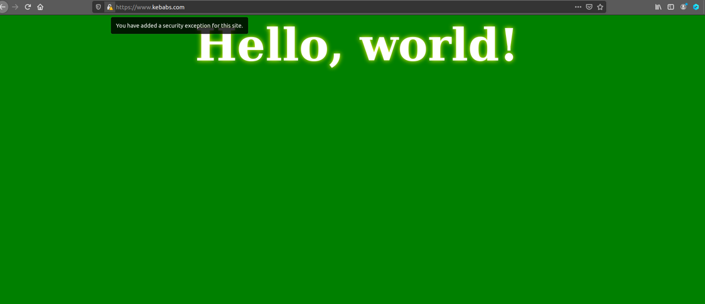


###Task 6

Para esta tarefa, assumimos que a CA foi compremetida por um atacante, portanto o atacante pode gerar os seus certificados para o website malicioso. Para isto, usamos os comandos: 

```
openssl req -newkey rsa:2048 -sha256 -keyout kebabs.key -out kebabs.csr -subj "/CN=www.kebabs.com/O=Kebabs Inc./C=US" -passout pass:dees
```
```
openssl ca -config openssl.cnf -policy policy_anything \
-md sha256 -days 3650 \
-in kebabs.csr -out kebabs.crt -batch \
-cert ca.crt -keyfile ca.key
```

Depois disto, alteramos os ficheiros Dockfile e fsi74_apache_ssl para suportarem os novos certificados.

Dockerfile: 
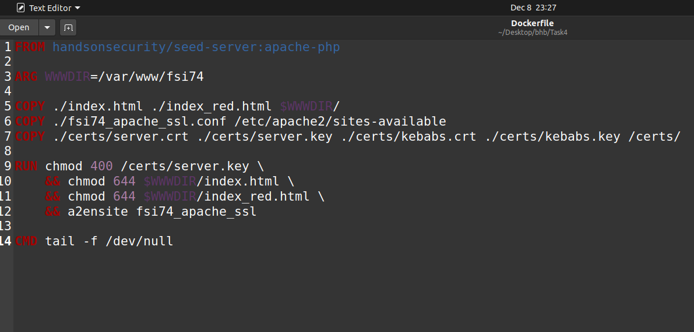

fsi74_apache_ssl:
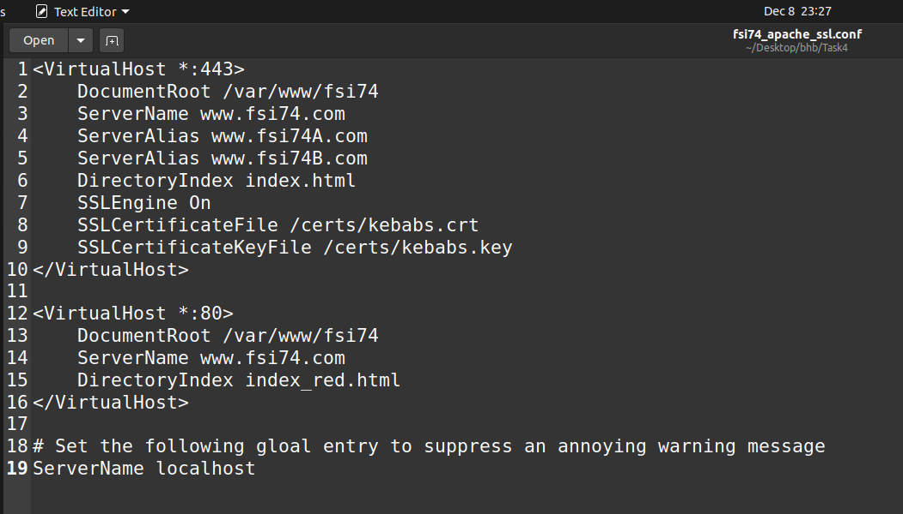

Com isto, reconstruimos o container e iniciamos o serviço apache. Desta forma, entrando no website "https://www.kebabs.com", o Firefox não criou um aviso de de segurança, apesar de mostrar que não reconhece o certeficado. O website "https://fsi74.com" continua com um funcionamento normal.
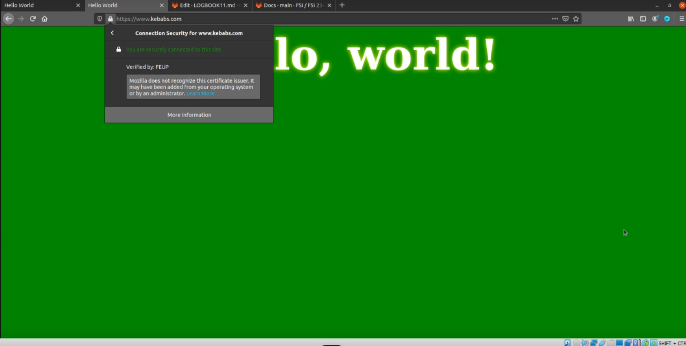
