# Logbook da Semana 13

## Preparação

Antes de começar o laboratório, é essencial preparar o ambiente de laboratório. Utilizamos o `Dockerfile docker-compose.yml` para ativar três containers, que representarão as três máquinas requeridas para o laboratório. A configuração foi realizada com os comandos `docker-compose build` e `docker-compose up`.

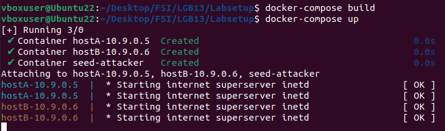

Após essa etapa, é necessário identificar os IDs dos containers. Isso foi alcançado utilizando o comando `docker ps`.

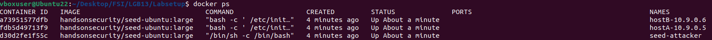

Com os IDs dos respectivos containers em mãos, prosseguimos abrindo um terminal em cada um deles através do comando `docker exec -it (ID do Container) /bin/bash`.

**Nota:** Este procedimento foi replicado para os outros dois containers, utilizando seus respectivos IDs.

Como última etapa na configuração do laboratório, era necessário identificar o nome da interface de rede estabelecida pelo Dockerfile. Para isso, usou-se o comando `ifconfig`, através do qual foi possível obter a seguinte informação:

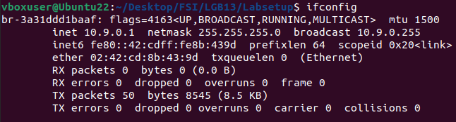

## Tarefa 1.1

### Tarefa 1.1A

Nesta tarefa, utilizamos o código fornecido para capturar pacotes que seriam transmitidos entre duas máquinas, alterando um dos argumentos para corresponder ao nome da nossa interface de rede.

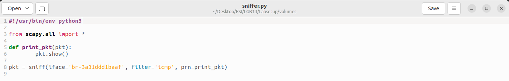

Após executarmos `chmod a+x sniffer.py` (onde `sniffer.py` é o nome do programa com o código fornecido) no terminal do container **"seed-attacker"**, iniciamos o programa para começar a captura dos pacotes.

Com o programa em execução, mudamos para o terminal do container **"hostB-10.9.0.6"** e realizamos um ping para o container **"hostA-10.9.0.5"**, utilizando o comando `ping 10.9.0.5 -c 1`.

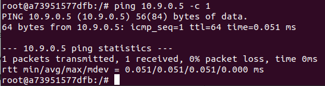

No terminal do container **"seed-attacker"**, podemos observar detalhes obre o pacote capturado:

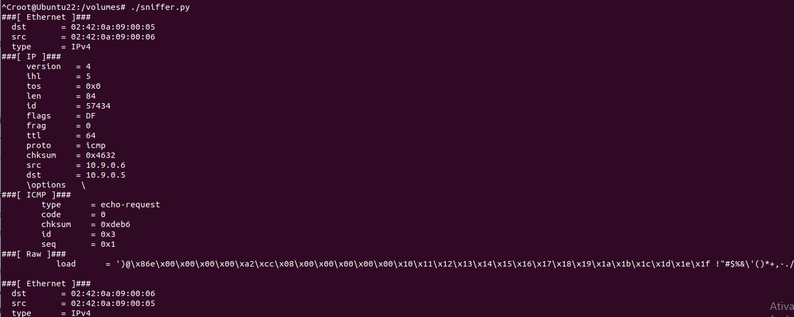

Depois disto, corremos o programa sem privilégios root e observamos o seguinte no terminal:

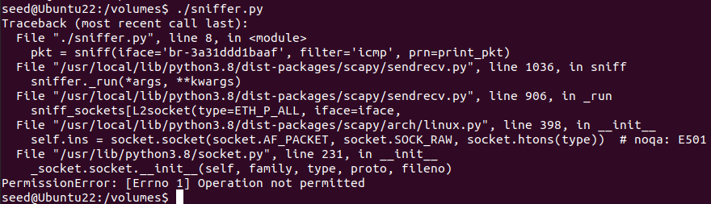

Sem os privilégios root, o programa não pode ser corrido e não é possivel capturar os pacotes.

### Tarefa 1.1B

Nesta tarefa, foi-nos solicitado capturar pacotes utilizando três filtros diferentes, conforme indicado nas instruções. Para isso, consultamos a "Cheat Sheet" do Scapy e modificamos o programa `sniffer.py` conforme os requisitos necessários.

- Capture only the ICMP packet - O programa já estava configurado para capturar exclusivamente pacotes ICMP.

- Capture any TCP packet that comes from a particular IP and with a destination port number 23 - Alterou-se o segundo parâmetro (**filter** na função **sniff**) para "tcp && src host 10.9.0.6 && dst port 23"

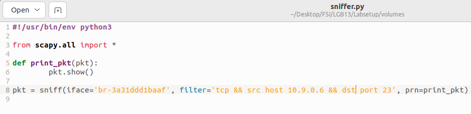

Após se correr o comando <code>telnet 10.9.0.5</code> no container do hostB,

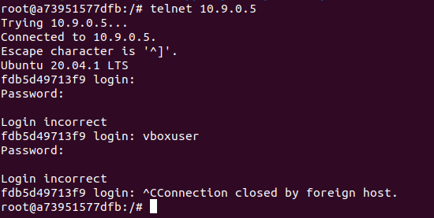

conseguimos observar um pacote capturado pelo nosso programa:

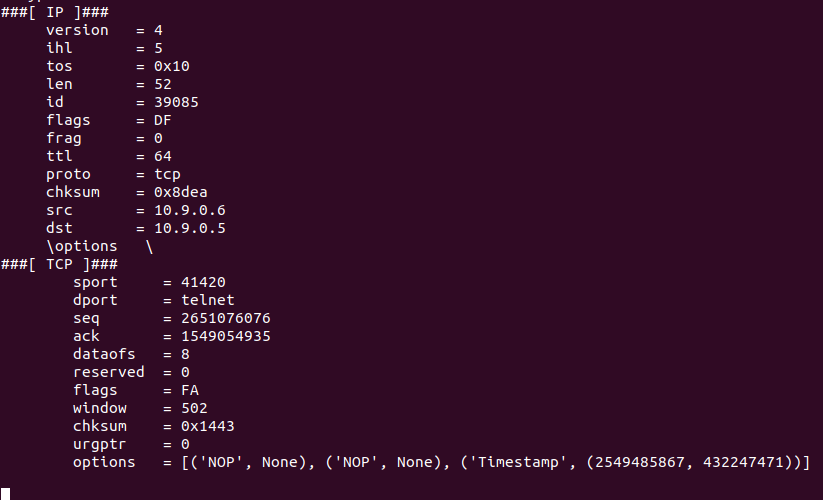

- Capture packets that come from or go to a particular subnet - Alterou-se o segundo parâmetro (**filter** na função **sniff**) para "net 128.230.0.0/16"

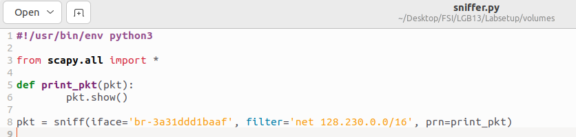

Após usar o comando <code>ping 128.230.0.11</code> no terminal do hostB, conseguimos observar um pacote capturado:

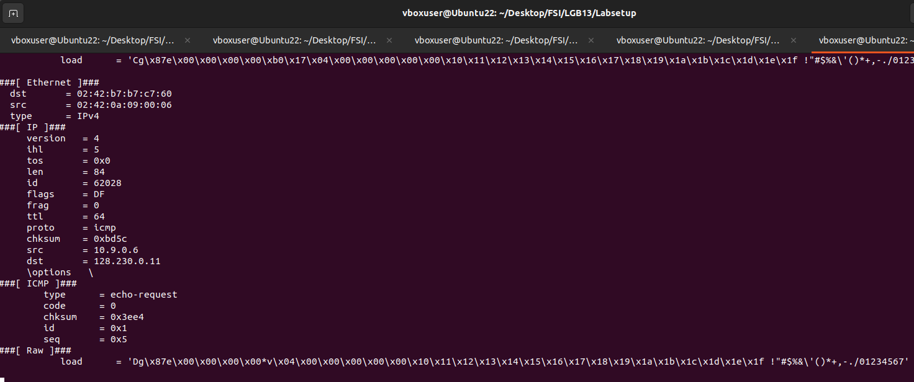
