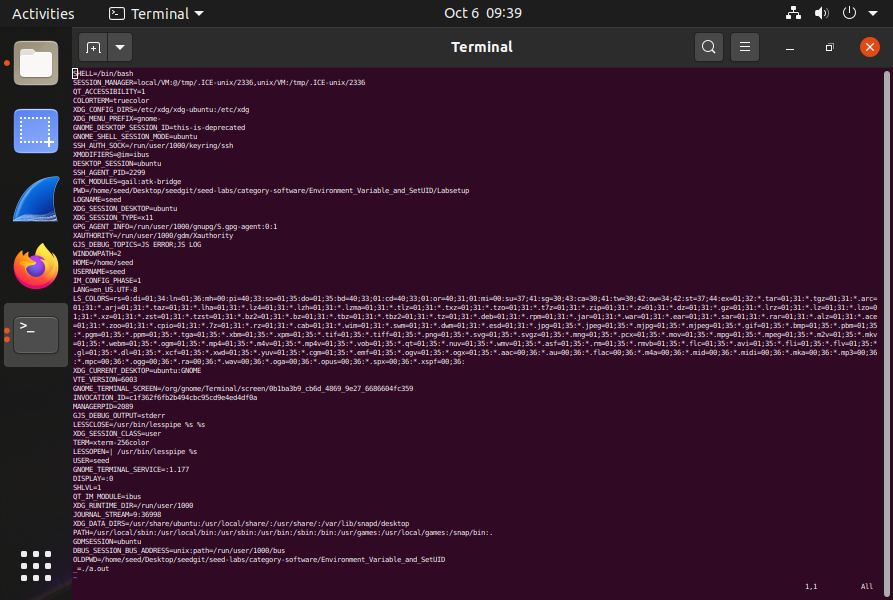
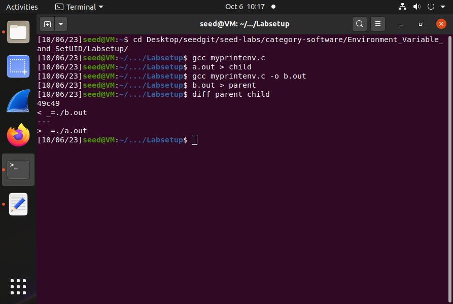
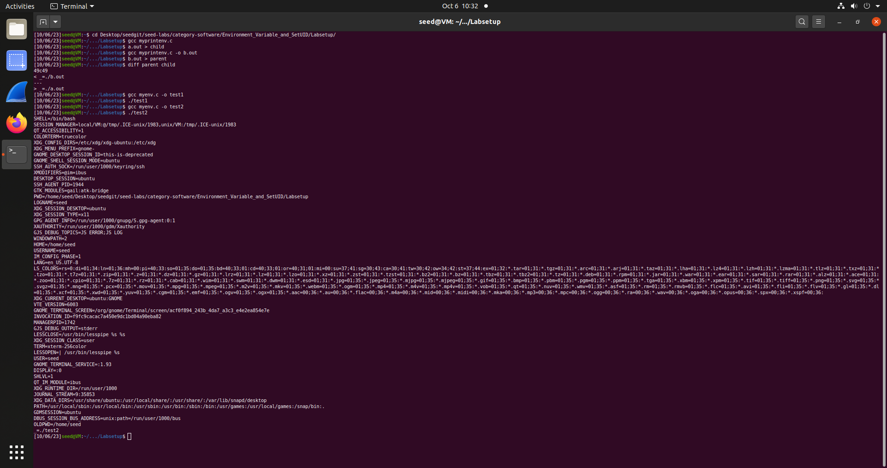
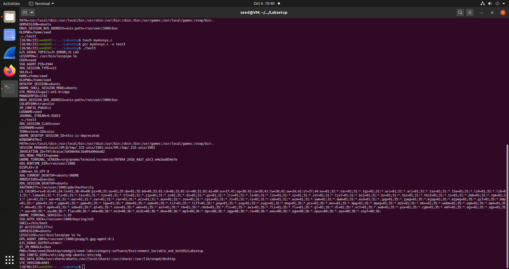
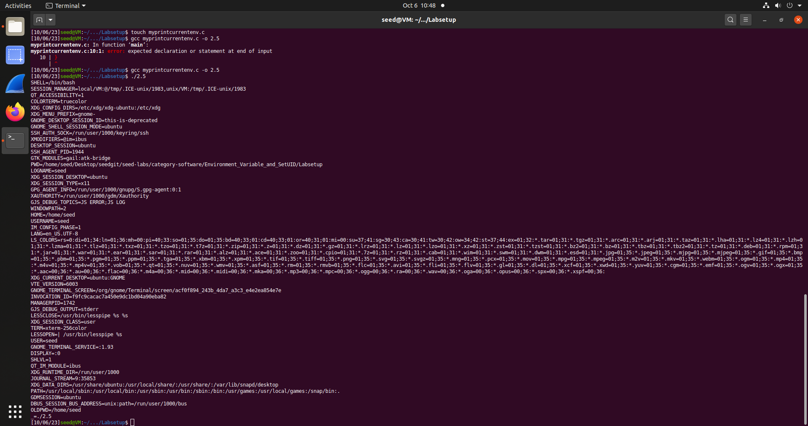
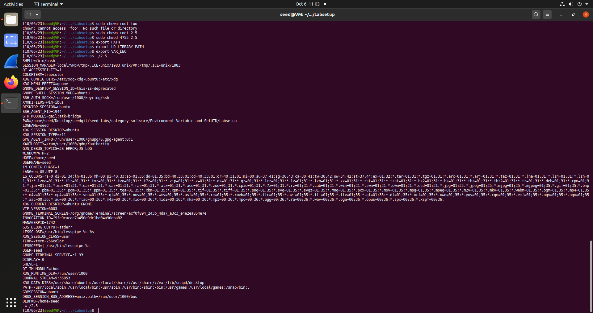
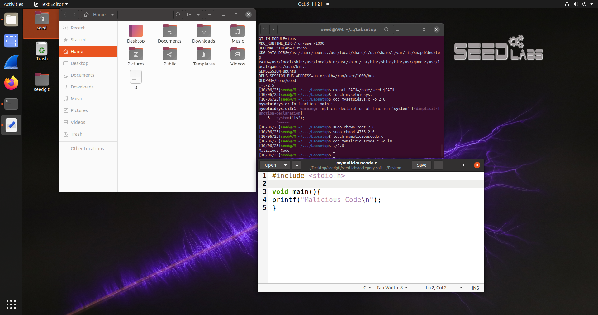
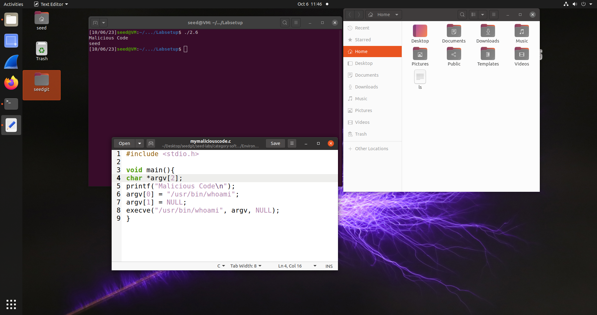
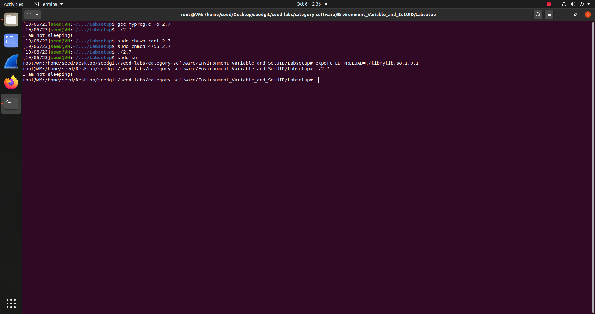

## 2.2
Resultado esperado: O child process herda as environment variables do parent process.

child - ficheiro das environment variables do child process

parent - ficheiro das environment variables do parent process

diff parent child: Não foram encontradas diferenças nas environment variables.

## 2.3
execve() 
Ao executar execve() com o segundo argumento a NULL não é passada nenhuma environment variable.
Utilizando "environ", um char com todas as variáveis ambiente, contudo, como segundo argumento, as variáveis são imprimidas.

## 2.4
system()
A função sistema chama uma nova shell para executar o programa. Passa as variáveis de ambiente para o execl() para o programa ser executado na dita nova shell. Ou seja esta nova shell irá ter acesso a todas as variáveis ambiente.

## 2.5

Após criar as nossas próprias environment variables, e ter mudado a ownership do programa criado para root, correndo novamente o programa, as variáveis criadas não constam na lista de outputs. 

Questionamo-nos se o set-uid limitava o número de variáveis que o child process pode receber pois esperavamos que, tendo previlégios root, todas as variáveis iriam aparecer, pois era de espectar, na nossa opinião, que a root tivesse acesso a todas elas. Contudo, concluímos que tal se deve ao facto de cada utilizador possuir o seu conjunto de variáveis ambiente, que existem separadamente das variáveis de ambiente de users diferentes. A root é um user diferente da seed, onde definimos as variáveis, pelo que as variáveis ambiente definidas no ambiente seed não aparecerão no ambiente root e vice versa.

## 2.6
O system(), tal como concluímos anteriormente, passa as variáveis de ambiente junto com o programa que chama. Como adulteramos a variável PATH, para incluir o home directory, e aparecendo este em primeiro lugar na string, quando a shell tenta procurar o programa ls, procura em primeiro lugar no home directory onde colocámos um "programa malicioso" com o nome "ls" que foi executado antes do verdadeiro programa ls. 

Portanto, sim, foi possível correr o nosso programa malicioso, que por sua vez não está a ser corrido com privilégios root:

## 2.7
- *Make myprog a regular program, and run it as a normal user*: "I am not sleeping!". Sabendo que a variável foi exportada dentro do ambiente do user que está a correr o myprog, o sleep assumido foi o definido dentro da libraria dinâmica criada, e não o sleep default.

- *Make myprog a Set-UID root program, and run it as a normal user*: slept. Sabendo que o programa está a ser corrido em root mas a variável ambiente foi exportada no ambiente do user, não é feita a conexão com a libraria dinâmica criada, pois a root, sendo um user diferente, tem as suas próprias variáveis ambiente, que só podem ser mudadas em ambiente root e que consequentemente não são herdadas do user.

- *Make myprog a Set-UID root program, export the LD PRELOAD environment variable again in the root account and run it* : "I am not sleeping!". De acordo com o concluído anteriormente, tendo-se agora exportado a variável em ambiente root, esta será assumida nas variáveis ambiente da root, e portanto o sleep assumido passa a ser o definido na libraria dinâmica.

- *Make myprog a Set-UID user1 program (i.e., the owner is user1, which is another user account), export the LD PRELOAD environment variable again in a different user’s account (not-root user) and run it* : Não foi possível encontrar um user1 para fazer o teste, mas baseando-nos nos resultados anteriores, prevemos que neste caso, o resultado será que o sleep normal irá ocorrer, pois a variável LD_PRELOAD foi exportada num outro user, sendo que concluímos que cada user possui o seu próprio conjunto de variáveis de ambiente.

