## Task 1

Elaborou-se em sql a query que busca todos os dados referentes ao utilizador cujo campo *Name* corresponde à string "Alice" na tabela *credentials*
```sql
SELECT * FROM credential WHERE name = "Alice";
```
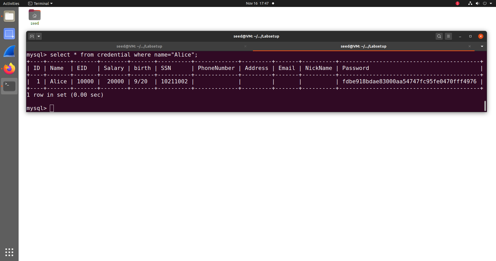

## Task 2

### 2.1
Abriu-se o link do site mencionado no guião em ambiente seed e analisou-se o ficheiro *unsafe_home.php*, sobretudo o segmento em sql: 

 ```sql 
 WHERE name= ’$input_uname’ and Password=’$hashed_pwd’ 
 ```

 Ora sabe-se que as condições para entrar como administrador são possuir o name "admin" e a respetiva password. Contudo, pela maneira como a query está estruturada, colocando-se na web page o username **admin'#**, é possível fechar manualmente a string com a plica e consequentemente escrever código em sql após a mesma. Colocando-se um #, todo o código à sua direita fica comentado, pelo que deixa de ser necessária a password, o elemento desconhecido. Com estes inputs a query resultante é a seguinte:

```sql
SELECT id, name, eid, salary, birth, ssn, address, email,
nickname, Password
FROM credential
WHERE name= ’admin’# and Password=’$hashed_pwd’ 
```
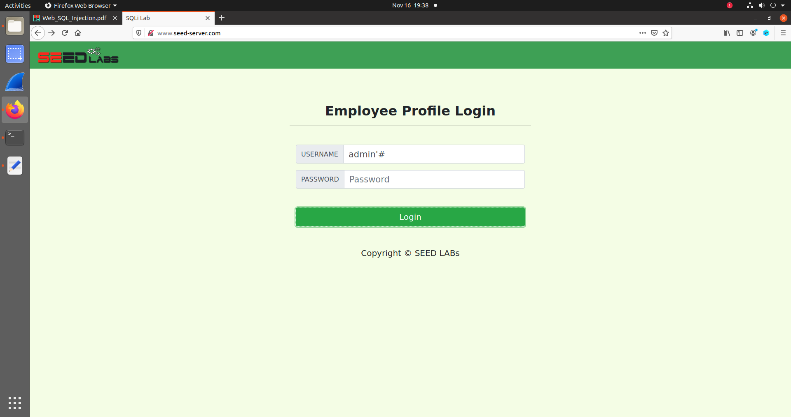

E assim, conseguindo-se logar com sucesso, encontra-se a seguinte página:

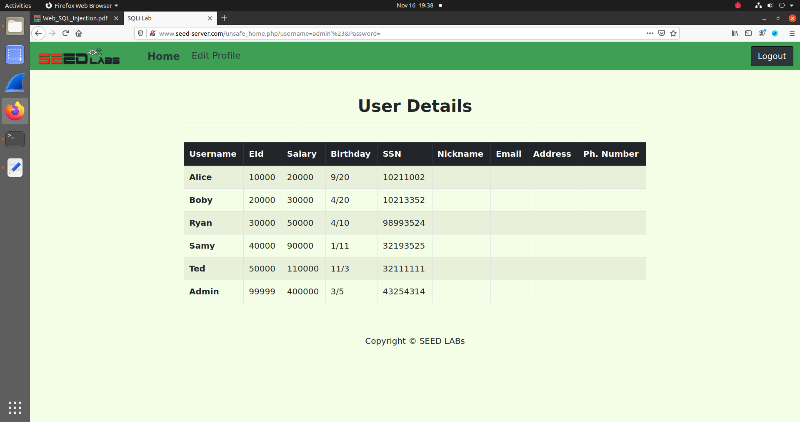

E desta forma foi possível aceder a todos os dados da tabela, logando com acesso administrativo.

### 2.2
O objetivo é o mesmo que o do segmento anterior, sendo que a própria string utilizada para logar como admninistrador, **admin'#**, é a mesma. A abordagem, contudo, foi o que diferenciou esta tarefa. Ao invés de executar o ataque pela web page, o ataque é forjado ao nível do terminal, através da realização de uma request **HTTP GET**. Os parâmetros são passados junto com o URL, pelo que o desafio é fazer o encoding dos caracteres especiais usados na string maliciosa, a plica e o cardinal. Segundo o guião, de modo a representar a plica deve-se utilizar **%27** e após uma breve pesquisa concluíu-se que o cardinal se representa por **%23**. Posto isto, elaborou-se o comando malicioso:

```shell
curl ’www.seed-server.com/unsafe_home.php?username=admin%27%23&Password=’
```

Executando esta request, foi impresso no terminal o código html da página do admin, com todas as informações desejadas:

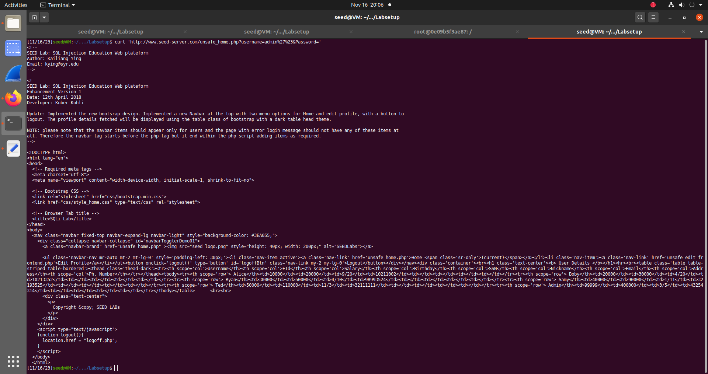


### 2.3
Analisando-se novamente o segmento em sql do ficheiro unsafe_home.php, concluiu-se que existe um input de username que torna possível terminar a query em causa e ainda injetar uma outra query elaborada por nós. O input elaborado foi o seguinte:
```sql
’;Delete * from credentials where name = "Alice";#
```

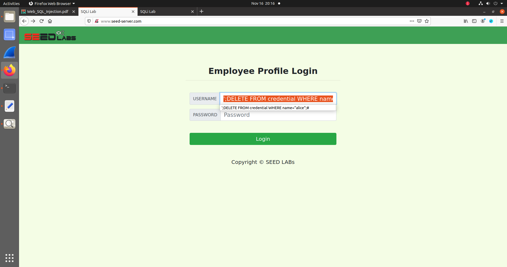
(na imagem acima aparece nas sugestões a string "alice" com a primeira letra minúscula, mas no input utilizado utilizou-se o mencionado acima, com "Alice)


O que levaria a que a query resultante fosse a seguinte:
```sql
(...)
WHERE name= ’’;Delete * from credentials where name = "Alice";# and Password=’$hashed_pwd’ 
```

Tal como para o exploit anterior, fecha-se a string manualmente de modo a inserir código sql a seguir. Utiliza-se o ponto e vírgula para terminar a query presente, e de seguida coloca-se a query maliciosa. Termina-se com um # de modo a comentar o código que se seguia, referente à password.

Contudo, desta vez, não foi possível concretizar o exploit:
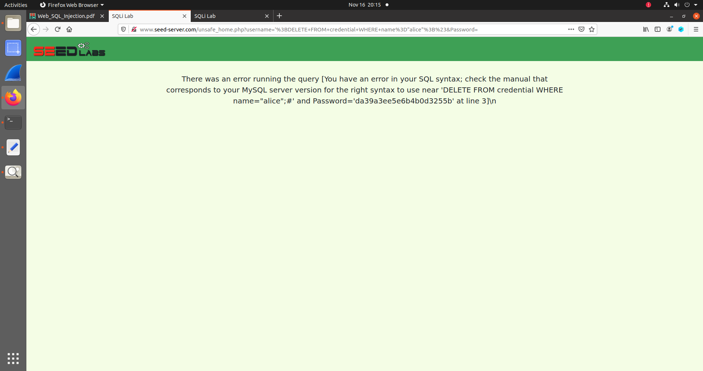


Após alguma pesquisa, concluiu-se que este resultado deveu-se ao facto de 
a extensão MySQL padrão em PHP não suportar stacked queries. As stacked queries permitem usar ponto-e-vírgula para separar instruções SQL em uma única consulta, tal como foi feito. Este tipo de funcionalidade só é suportada nas extensões mysqli e PDO do PHP.


## Task 3.

### 3.1 

Analisou-se o ficheiro *unsafe_edit_frontend.php*, em específico o segmento sql. Concluiu-se que de modo a alterar o salário da Alice, seria necessário, dentro do statement de update, injetar <code>"salary = valor_desejado"</code> de modo a também alterar essa valor na tabela.
De modo a fazer isso, na seccção de edição de perfil, em nickname, utilizou-se o seguinte input:<code> Alice', salary= '1000000</code>.

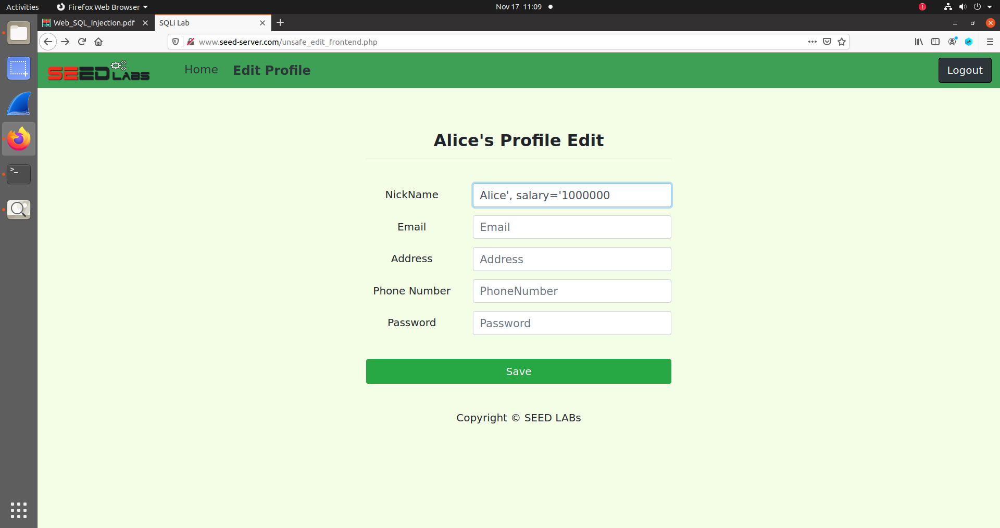


Introduziu-se o nickname "Alice" de modo a preservar o seu nome e de seguida, mais uma vez, terminou-se a string manualmente. Posteriormente colocou-se o segmento de código de mudança de salário mencionada e deixou-se a string por fechar de modo a que a plica no código que fecharia a string de nickname, feche a string inserida no salário. Deste modo foi possível mudar o salário da Alice.

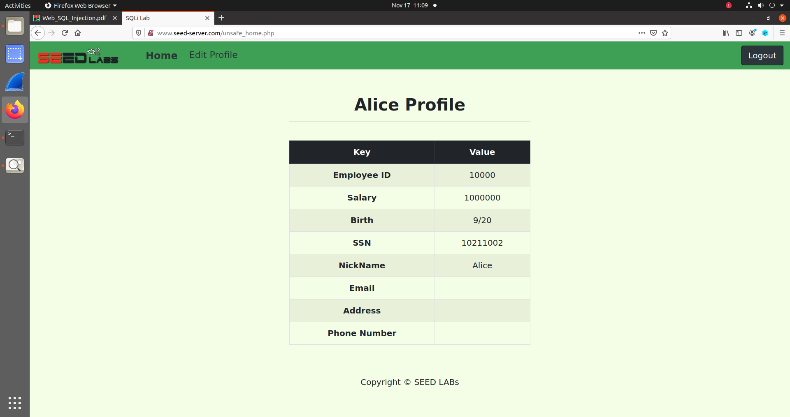


### 3.2
De modo a alterar o salário do Boby o raciocínio é semelhante, sendo que apenas é necessário explicitar que a mudança terá de ser feita onde o nome do utilizador é Boby, de modo a não acabar a mudar o salário da Alice. Para isso, fez-se o seguinte:
<code> Boby', salary= '1' WHERE name= 'Boby';#</code>

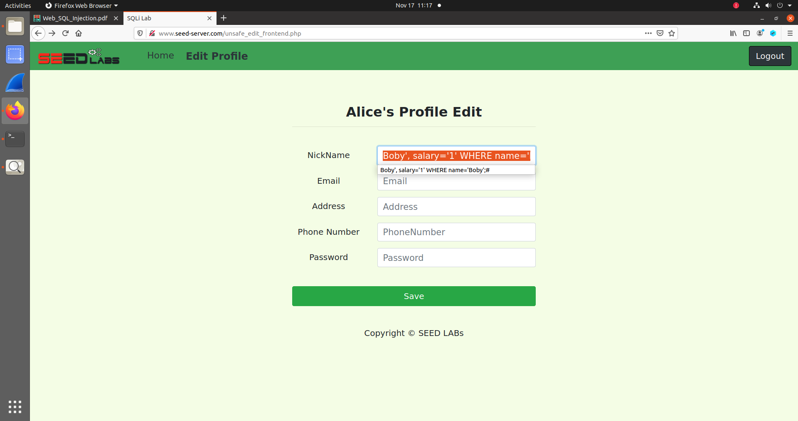

Introduziu-se o nickname "Boby" de modo a preservar o seu nome e de seguida, terminou-se a string manualmente. Posteriormente colocou-se o segmento de código de mudança de salário e de seguida, o segmento de código onde é explicitada a linha da tabela a mudar. Fechou-se a string, terminou-se o statement com um ponto e vírgula e por fim descartou-se todo o código que se seguia com #. Deste modo foi possível mudar o salário do Boby

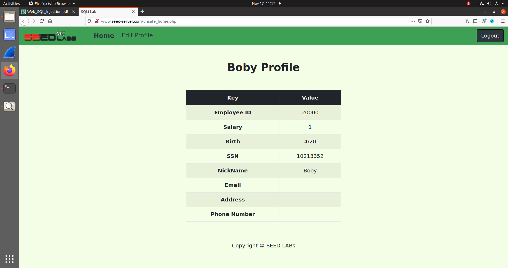


### 3.3
De modo a alterar a password do boby, o racícinio é idêntico à tarefa 3.2, exceto que desta vez o campo mudado é Password e não salary. Contudo, após análise do código, conluiu-se que a password guardada não é a string propriamente dita, mas sim o resultado do seu hash em SHA1, tal como mencionado no guião. Desta forma, se a Alice quiser mudar a password do Boby, terá de inserir, não a password desejada mas o seu hash. Assim, para esta tarefa escolheu-se que a password a mudar seria "boby". Pesquisando por "SHA1" na internet encontrou-se um conversor simples e introduziu-se "boby", obtendo-se o seguinte hash:
**8fc8dd2efccb29d7e65fd35c2e035c8c203e19a1**

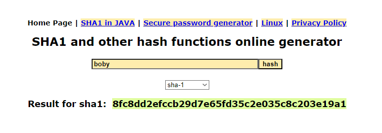

Posteriormente, colocou-se o seguinte input:
<code>Boby', Password='8fc8dd2efccb29d7e65fd35c2e035c8c203e19a1' WHERE name='Boby';#</code>

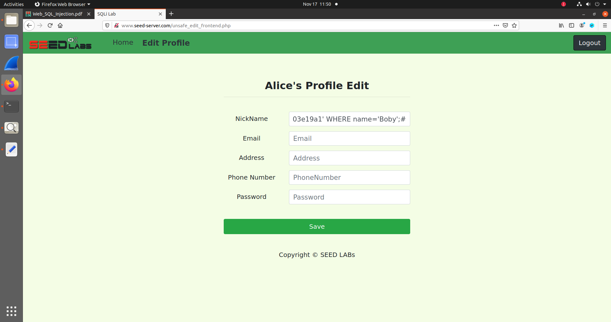

Desta forma, foi possível mudar a password do Boby para "boby", e utilizá-la para logar na conta do Boby tal como se pode verificar abaixo:
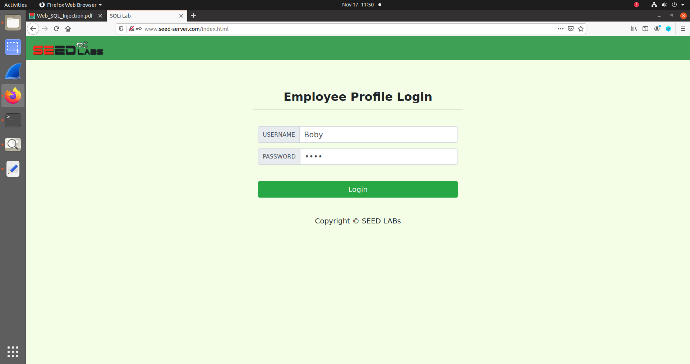
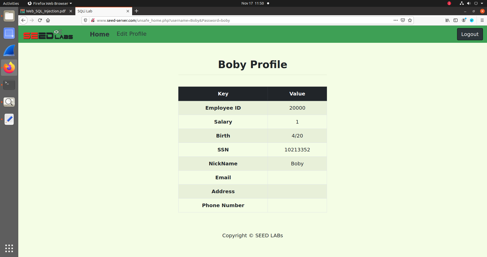


